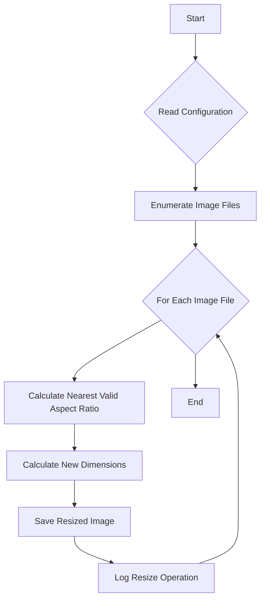

# Arbitrary Image Resizer

## Warning
This was entirely generated by GPT-4. Not a single brain cell was used for any of this project. I suggest looking at the code and making sure it does what you think it does, because I sure didn't read it.

---

This is an application that resizes images in a specified folder to the nearest valid aspect ratio. The application supports both jpg and png image formats.

The resizing process does not overwrite the original images, but instead saves a copy with the new dimensions. The application is built to process images in parallel to increase the efficiency of the operation.

## Configuration
The application uses a JSON configuration file, config.json, to specify the valid aspect ratios. The aspect ratios are defined as a list of "width" and "height" objects.

Here is an example of a valid configuration file:
```json
{
    "AspectRatios": [
        {"Width": 2, "Height": 1},
        {"Width": 3, "Height": 1}
    ]
}
```
In the above example, the application will resize images to match the nearest of the 2:1 or 3:1 aspect ratios.

## Usage
To use the application:

Place the images you want to resize in the inputs directory.
Run the application. Resized images will be placed in the outputs directory.
Check the resize_log.csv file in the outputs directory for a record of the resizing operation. This file includes the old and new filenames, the old and new dimensions, and the old and new aspect ratios for each image processed.

## How It Works
The application reads the list of valid aspect ratios from the config.json file. It then finds all jpg and png files in the inputs directory and processes them in parallel.

For each image, the application calculates the nearest valid aspect ratio by comparing the aspect ratio of the image to the list of valid aspect ratios. The application then calculates the new dimensions of the image based on this nearest valid aspect ratio.

Finally, the application saves a copy of the image with the new dimensions in the outputs directory and writes the details of the resizing operation to the resize_log.csv file.

## Workflow Diagram
